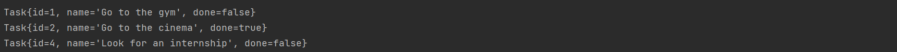

# CLI Task Manager Project

Task Manager nested to the terminal. It takes user input and reacts accordingly (except of course if we select to exit the program).

## Objectives
* Solve simple algorithmic problems
* Design a logical solution to a problem
* Solve a basic problem using code

## Features

* Show the tasks
* Add a task
* Delete a task
* Mark a task as done
* Update a task

## Interface

### Main Menu

### See All Tasks

### Add New Task

### Delete Task

### Mark Task Done

### Update Task

### Exit

